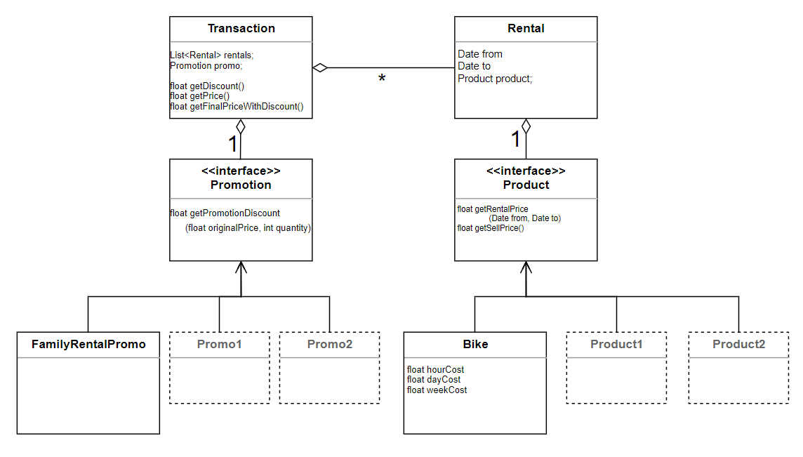
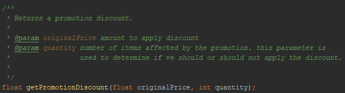
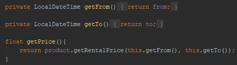
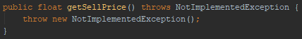
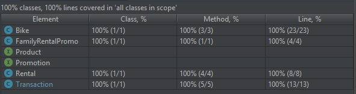
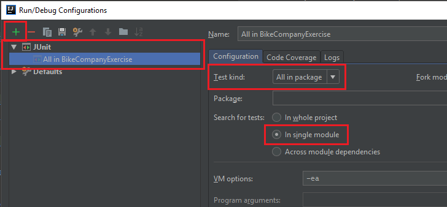

# Bike Company Excercise
### Context
A company rents bikes under following options:
1. Rental by hour, charging $5 per hour
2. Rental by day, charging $20 a day
3. Rental by week, changing $60 a week
4. Family Rental, is a promotion that can include from 3 to 5 Rentals (of any type) with a discount
of 30% of the total price
### Assigment:
1. Implement a set of classes to model this domain and logic
2. Add automated tests to ensure a coverage over 85%
3. Use GitHub to store and version your code
4. Apply all the recommended practices you would use in a real project
5. Add a README.md file to the root of your repository to explain: your design, the development 
practices you applied and how run the tests.
Note: we don't expect any kind of application, just a set of classes with its automated tests.

##### Language: JAVA

### Deliverables:
The link to your repository

# Resolution

### Design
To explain our design, we will first refer to the following class diagram:



Our main class is "Transaction". this will act as an interface against the applications that consume the API.
 
In *Transaction* we will find methods such as:
- getDiscount()
- getPrice()
- getFinalPriceWithDiscount()

Before using these methods, we must first create the transaction 
(assigning the corresponding promotion) and then add each rental.

Another important class is "Rental". It contains the **Product** to be rented as well as "From and to" dates of the rental.

We emphasize the interface **Product** since here we have applied the design pattern "Strategy". We did this to create a layer of abstraction between the rental operation and the rental bicycles. In this way, tomorrow, we can extend our application for rentals of any other type of product.

Also, in this Interface, we add the method "*getSellPrice()*" which, although it is not used, is already planned for a future expansion of our program and also can calculate sale prices.

On the other hand we have the interface "*Promotion*". Like product, we created this interface to be able to decouple the implementation of our promotion and be able to extend our program in the future with different promotions.

We can find a complete explanation of the *Strategy* pattern used in the following link: [Patron Strategy](https://sourcemaking.com/design_patterns/strategy)

### Development practices

One practice that we used was to self-document our code. this way any developer can understand the code when it is time to modify it.




We also use encapsulation and double encapsulation: not only other classes can access the parameters through their access methods, but also the same class accesses their parameters with their access methods.
This is considered a good practice, since the details of the implementation can change at any time without affecting other parts of the program



We use exceptions to report errors, and to be able to correctly manipulate them.




We use the "Maven" framework to manage the dependencies of our software.

With JUnit 5 we carry out all the tests of our software.
A TDD methodology was not applied, since we did not have a specification of the methods that we should implement. however, our test set covers 100% of the classes, methods and lines.



In addition to 100% code coverage, we also perform a series of tests to ensure that the logic within our methods is correct:
```
Price Calculator Validations:

Weeks: 0 Days: 0 Hours: 0 Minutes: 0 | PRICE: 0.0
Weeks: 0 Days: 0 Hours: 1 Minutes: 0 | PRICE: 5.0
Weeks: 0 Days: 0 Hours: 1 Minutes: 30 | PRICE: 10.0
Weeks: 0 Days: 0 Hours: 4 Minutes: 0 | PRICE: 20.0
Weeks: 0 Days: 0 Hours: 23 Minutes: 0 | PRICE: 20.0
Weeks: 0 Days: 1 Hours: 0 Minutes: 0 | PRICE: 20.0
Weeks: 0 Days: 1 Hours: 0 Minutes: 30 | PRICE: 25.0
Weeks: 0 Days: 1 Hours: 1 Minutes: 0 | PRICE: 25.0
Weeks: 0 Days: 1 Hours: 1 Minutes: 30 | PRICE: 30.0
Weeks: 0 Days: 1 Hours: 4 Minutes: 0 | PRICE: 40.0
Weeks: 0 Days: 1 Hours: 5 Minutes: 0 | PRICE: 40.0
Weeks: 0 Days: 1 Hours: 23 Minutes: 0 | PRICE: 40.0
Weeks: 0 Days: 2 Hours: 0 Minutes: 0 | PRICE: 40.0
Weeks: 0 Days: 2 Hours: 1 Minutes: 0 | PRICE: 45.0
Weeks: 0 Days: 2 Hours: 1 Minutes: 30 | PRICE: 50.0
Weeks: 0 Days: 2 Hours: 23 Minutes: 0 | PRICE: 60.0
Weeks: 0 Days: 4 Hours: 0 Minutes: 0 | PRICE: 60.0
Weeks: 1 Days: 0 Hours: 0 Minutes: 0 | PRICE: 60.0
Weeks: 1 Days: 0 Hours: 1 Minutes: 0 | PRICE: 65.0
Weeks: 1 Days: 1 Hours: 1 Minutes: 0 | PRICE: 85.0
Weeks: 1 Days: 5 Hours: 0 Minutes: 0 | PRICE: 120.0
Weeks: 2 Days: 0 Hours: 0 Minutes: 0 | PRICE: 120.0
```

All our tests are inside the "test" folder and in order to execute them we must configure in our IDE (in this case IntelliJ) a JUnit execution.



### Warnings and considerations. 
We had to make some arbitrary decisions when proposing the exercise.
    
for example,

- Under what criteria is considered a day? 24hs?
- 1:10hs of rent, count as 1 hour or as 2 hours?
- Are the 10 minutes exceeded, charged as one full hour or one proportional?
    
In a real scenario, with a real customer, this type of queries would have been raised for a correct implementation of the business logic.

